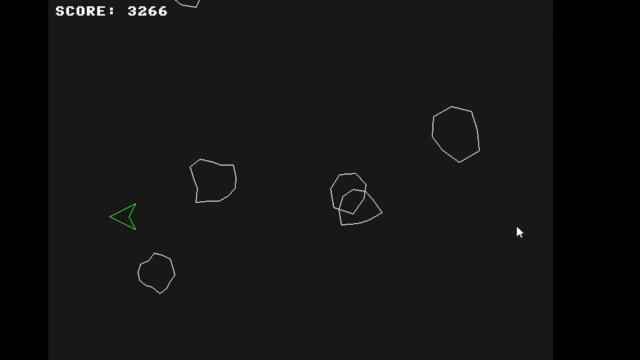

# Asteroids Survival

**Asteroids Survival** is a classic **90’s arcade-style Asteroids game** built entirely in **C++** using the **ClinetGFX** graphics library.

The project focuses on low-level graphics, real-time movement, and collision detection, all implemented from the ground up using a software framebuffer. No game engines — just pixels, math, and C++.

---

##  Gameplay Preview

<p align="center">
  
</p>

---

## Graphics Library Used

**Asteroids Survival** uses **ClinetGTX** an open source graphics library I built in C++ that can be used to build simple C++ 80-90's arcade style games.

**ClinetGFX** repository: https://github.com/AuSinW/ClinetGFX-Graphics-Library-for-Windows

##  Features

-  Player-controlled ship
-  Real-time collision detection
-  Procedural asteroid generation
-  Classic arcade-style movement and feel
-  Built entirely from scratch using ClinetGFX

---

##  About the Project

This project began as a way to refresh my C++ knowledge and to explore, from the ground up, how computer graphics come to life. What started as a small learning exercise gradually evolved into a complete, playable demo inspired by classic arcade games.

Asteroids Survival serves both as:
- A **learning project** for understanding graphics and game logic
- A **proof-of-concept** for what can be built using the ClinetGFX library

---

##  Built With

- **C++**
- **ClinetGFX** – custom framebuffer-based graphics library
- **Makefile** build system

---

## ▶️ Building & Running

A Makefile is included for easy compilation.

Be sure to change the folliwng line as needed:

```makefile
CXXFLAGS = -Wall -std=c++17 -Iinclude -I../path/to/ClinetGFX


